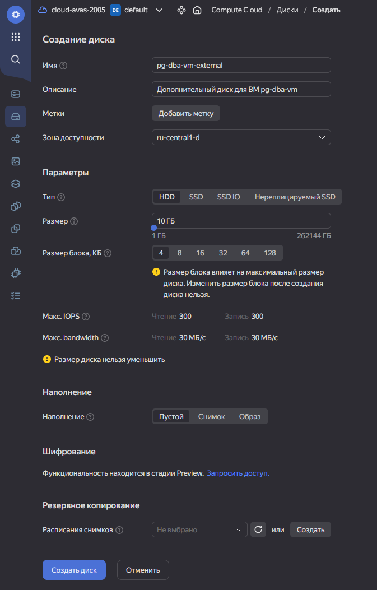
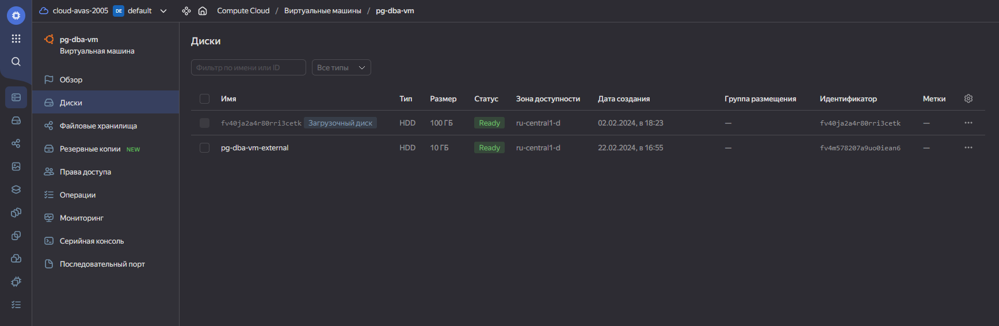
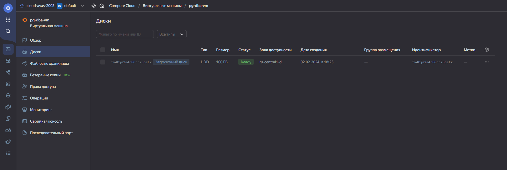
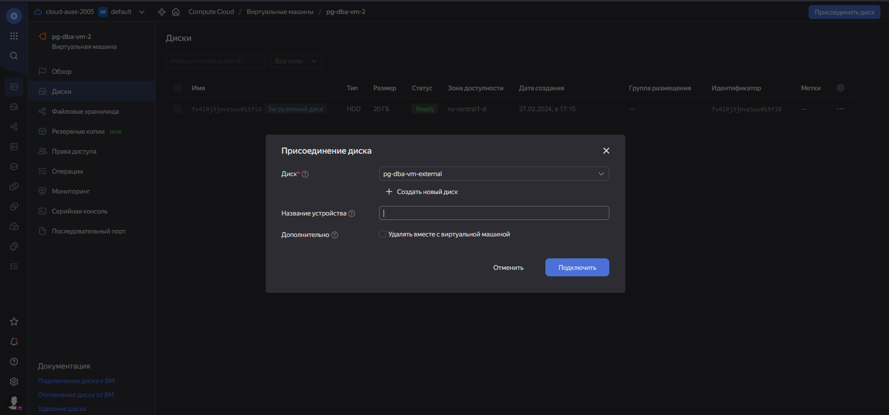

# Физический уровень в PostgreSQL

## Подготовка окружения
Для выполнения задания будет использоваться виртуальная машина, созданная в рамках [одного из предыдущих домашних заданий](../1-postgresql-isolation-levels/README.md#подготовка-виртуальной-машины-и-установка-субд).

Будет использоваться кластер PostgreSQL 14 - он был развёрнут на этой машине в том же задании и работает до сих пор.
```bash
a-vasenev@pg-dba-vm:~$ pg_lsclusters
Ver Cluster Port Status Owner    Data directory              Log file
14  main    5432 online postgres /var/lib/postgresql/14/main /var/log/postgresql/postgresql-14-main.log
```
Текущее домашнее задание предлагает использовать PostgreSQL 15, но не думаю, что между 14 и 15 версией в устройстве физического уровня что-то кардинально поменялось. Поэтому вряд ли эта разница будет критичной для выполнения текущего домашнего задания.

В задании нам нужно будет убедиться, что данные действительно переносятся, а для этого нужны будут какие-нибудь данные. 🙂 Поэтому создадим в БД по умолчанию (`postgres`) какую-нибудь таблицу - по её наличию и содержимому можно будет понять, действительно ли мы имеем дело с теми же данными.
```
a-vasenev@pg-dba-vm:~$ psql -h localhost -U postgres
Password for user postgres:
psql (14.10 (Ubuntu 14.10-0ubuntu0.22.04.1))
SSL connection (protocol: TLSv1.3, cipher: TLS_AES_256_GCM_SHA384, bits: 256, compression: off)
Type "help" for help.

postgres=# create table test_table (value integer primary key);
CREATE TABLE
postgres=# insert into test_table (value) select generate_series(1, 1000);
INSERT 0 1000
postgres=# select * from test_table limit 10;
 value
-------
     1
     2
     3
     4
     5
     6
     7
     8
     9
    10
(10 rows)
```

## Добавление нового виртуального диска
Создадим в той же учётной записи Yandex Cloud новый диск (HDD, 10 ГБ):



Подключим его к виртуальной машине:


Диск подключился практически сразу же и определился под именем `/dev/vdb`, перезагрузка машины не понадобилась:
```bash
a-vasenev@pg-dba-vm:~$ lsblk
NAME   MAJ:MIN RM  SIZE RO TYPE MOUNTPOINTS
loop0    7:0    0 63.9M  1 loop /snap/core20/2182
loop1    7:1    0 63.9M  1 loop /snap/core20/2105
loop2    7:2    0   87M  1 loop /snap/lxd/26975
loop3    7:3    0   87M  1 loop /snap/lxd/27037
loop4    7:4    0 49.8M  1 loop /snap/snapd/18357
loop5    7:5    0 40.4M  1 loop /snap/snapd/20671
vda    252:0    0  100G  0 disk
├─vda1 252:1    0    1M  0 part
└─vda2 252:2    0  100G  0 part /
vdb    252:16   0   10G  0 disk
```

Для того, чтобы этот диск можно было использовать для хранения данных, создадим на нём раздел при помощи утилиты `fdisk`. Для этого будем использовать следующие команды:
- `g` для инициализации таблицы разделов;
- `n` для создания нового раздела (будем использовать параметры по умолчанию, и утилита `fdisk` выберет их значения так, чтобы раздел полностью заполнил свободное пространство);
- `p` для просмотра таблицы разделов (чтобы убедиться, что всё было сделано верно);
- `w` для применения изменений и разметки диска.
```
a-vasenev@pg-dba-vm:~$ sudo fdisk /dev/vdb

Welcome to fdisk (util-linux 2.37.2).
Changes will remain in memory only, until you decide to write them.
Be careful before using the write command.

Device does not contain a recognized partition table.
Created a new DOS disklabel with disk identifier 0x4fda934d.

Command (m for help): g
Created a new GPT disklabel (GUID: 07A1E6B7-347B-7649-ADE3-F9FE41C4A858).

Command (m for help): n
Partition number (1-128, default 1):
First sector (2048-20971486, default 2048):
Last sector, +/-sectors or +/-size{K,M,G,T,P} (2048-20971486, default 20971486):

Created a new partition 1 of type 'Linux filesystem' and of size 10 GiB.

Command (m for help): p
Disk /dev/vdb: 10 GiB, 10737418240 bytes, 20971520 sectors
Units: sectors of 1 * 512 = 512 bytes
Sector size (logical/physical): 512 bytes / 4096 bytes
I/O size (minimum/optimal): 4096 bytes / 4096 bytes
Disklabel type: gpt
Disk identifier: 07A1E6B7-347B-7649-ADE3-F9FE41C4A858

Device     Start      End  Sectors Size Type
/dev/vdb1   2048 20971486 20969439  10G Linux filesystem

Command (m for help): w
The partition table has been altered.
Calling ioctl() to re-read partition table.
Syncing disks.

a-vasenev@pg-dba-vm:~$
```

Отформатируем созданный раздел в какую-нибудь файловую систему - например, `ext4`:
```bash
a-vasenev@pg-dba-vm:~$ sudo mkfs.ext4 /dev/vdb1
mke2fs 1.46.5 (30-Dec-2021)
Creating filesystem with 2621179 4k blocks and 655360 inodes
Filesystem UUID: 2e85d33f-d177-42af-bcf6-58f4efb86da1
Superblock backups stored on blocks:
        32768, 98304, 163840, 229376, 294912, 819200, 884736, 1605632

Allocating group tables: done
Writing inode tables: done
Creating journal (16384 blocks): done
Writing superblocks and filesystem accounting information: done
```

Теперь всё готово к тому, чтобы смонтировать этот раздел и начать его использовать:
```bash
a-vasenev@pg-dba-vm:~$ sudo mkdir /mnt/pg-dba-vm-external
a-vasenev@pg-dba-vm:~$ sudo mount /dev/vdb1 /mnt/pg-dba-vm-external/
```

На всякий случай я решил его также добавить в файл `/etc/fstab`, чтобы в дальнейшем диск монтировался автоматически, без возни с ручным монтированием:
```bash
a-vasenev@pg-dba-vm:~$ sudo nano -w /etc/fstab
```
```
# <file system> <mount point>   <type>  <options>       <dump>  <pass>

# Следующая строка была добавлена:
/dev/vdb1 /mnt/pg-dba-vm-external ext4 defaults 0 1
```
На этом подключение диска успешно завершено. 🙂

## Перенос данных существующего кластера на подключенный диск

Теперь займёмся переносом данных кластера на диск, подключенный в предыдущем разделе.

Поскольку в этом разделе мы будем работать с данными кластера PostgreSQL, кластер придётся остановить:
```bash
a-vasenev@pg-dba-vm:~$ sudo pg_ctlcluster 14 main stop
a-vasenev@pg-dba-vm:~$ pg_lsclusters
Ver Cluster Port Status Owner    Data directory              Log file
14  main    5432 down   postgres /var/lib/postgresql/14/main /var/log/postgresql/postgresql-14-main.log
```

Сервер PostgreSQL по умолчанию работает от имени пользователя ОС `postgres`. Если мы будем переносить данные в другую директорию, то нужно будет убедиться, что этот пользователь будет иметь права на запись в эту директорию:
```bash
a-vasenev@pg-dba-vm:~$ sudo chown -R postgres:postgres /mnt/pg-dba-vm-external/
a-vasenev@pg-dba-vm:~$ sudo chmod -R 755 /mnt/pg-dba-vm-external/
```

Наконец, перенесём данные кластера и попробуем его запустить:
```
a-vasenev@pg-dba-vm:~$ sudo mv /var/lib/postgresql/14 /mnt/pg-dba-vm-external/
a-vasenev@pg-dba-vm:~$ ls -lA /mnt/pg-dba-vm-external
total 20
drwxr-xr-x 3 postgres postgres  4096 Feb  2 11:32 14
drwxr-xr-x 2 postgres postgres 16384 Feb 22 10:29 lost+found
a-vasenev@pg-dba-vm:~$ ls -lA /var/lib/postgresql
total 8
-rw------- 1 postgres postgres  60 Feb 22 09:41 .bash_history
-rw------- 1 postgres postgres 303 Feb 22 09:41 .psql_history
a-vasenev@pg-dba-vm:~$ sudo pg_ctlcluster 14 main start
Error: /var/lib/postgresql/14/main is not accessible or does not exist
```
Как видно, кластер не запустился по вполне понятной причине - мы перенесли его данные, но сервер об этом по-прежнему не знает и ожидает найти их там, где они были до остановки кластера (`/var/lib/postgresql/14/main`). Для того, чтобы он снова смог с ними работать, нужно указать их новое расположение в файле `postgresql.conf`, параметр `data_directory`:
```bash
a-vasenev@pg-dba-vm:~$ sudo nano -w /etc/postgresql/14/main/postgresql.conf
```
```
...

#------------------------------------------------------------------------------
# FILE LOCATIONS
#------------------------------------------------------------------------------

# Значение по умолчанию для следующего параметра - '/var/lib/postgresql/14/main'.
# Оно было изменено для этого домашнего задания.
data_directory = '/mnt/pg-dba-vm-external/14/main'

...
```
Снова попробуем запустить кластер:
```
a-vasenev@pg-dba-vm:~$ sudo pg_ctlcluster 14 main start
a-vasenev@pg-dba-vm:~$ pg_lsclusters
Ver Cluster Port Status Owner    Data directory                  Log file
14  main    5432 online postgres /mnt/pg-dba-vm-external/14/main /var/log/postgresql/postgresql-14-main.log
```
На этот раз данные действительно находятся в директории, указанной в `postgresql.conf`, поэтому кластер запустился без ошибок. Осталось только убедиться, что данные, записанные в БД при подготовке окружения, не потерялись при переносе:
```
a-vasenev@pg-dba-vm:~$ psql -h localhost -U postgres
Password for user postgres:
psql (14.10 (Ubuntu 14.10-0ubuntu0.22.04.1))
SSL connection (protocol: TLSv1.3, cipher: TLS_AES_256_GCM_SHA384, bits: 256, compression: off)
Type "help" for help.

postgres=# select setting from pg_settings where name = 'data_directory';
             setting
---------------------------------
 /mnt/pg-dba-vm-external/14/main
(1 row)

postgres=# \d
           List of relations
 Schema |    Name    | Type  |  Owner
--------+------------+-------+----------
 public | test_table | table | postgres
(1 row)

postgres=# select * from test_table limit 10;
 value
-------
     1
     2
     3
     4
     5
     6
     7
     8
     9
    10
(10 rows)
```
Итак, данные по-прежнему доступны, а значит, перенос данных прошёл успешно. 🎉

## Задание со звёздочкой: доступ к этим же данным из другого кластера

Теперь попробуем поднять ещё один кластер PostgreSQL 14, заставим его использовать те же данные и проверим, что из этого получится и что для этого потребуется. Для этого создадим в Yandex Cloud ещё одну виртуальную машину. От неё не потребуется высокая производительность, поэтому подойдут практически любые параметры:
* CPU: Intel Ice Lake, 2 ядра, гарантированная доля 20%
* RAM: 2 ГБ
* Диск: HDD, 20 ГБ
* ОС: Ubuntu 22.04

Установим на неё PostgreSQL 14 (версия по умолчанию в репозиториях Ubuntu 22.04):
```bash
a-vasenev@pg-dba-vm-2:~$ sudo apt-get update
a-vasenev@pg-dba-vm-2:~$ sudo apt-get upgrate
a-vasenev@pg-dba-vm-2:~$ sudo apt-get install postgresql postgresql-contrib
```

Отмонтируем диск с данными PostgreSQL с первой машины. Кластер, к которому мы подключались ранее, всё ещё работает с данными в этой директории, поэтому его придётся остановить.
```bash
a-vasenev@pg-dba-vm:~$ sudo pg_ctlcluster 14 main stop
a-vasenev@pg-dba-vm:~$ sudo umount /dev/vdb1
```

Отсоединим диск с данными в веб-интерфейсе Yandex Cloud от первой машины и присоединим ко второй машине.





Как и при присоединении диска ранее, изменения применились "на горячую", без перезапуска виртуальных машин.
```bash
a-vasenev@pg-dba-vm-2:~$ lsblk
NAME   MAJ:MIN RM   SIZE RO TYPE MOUNTPOINTS
loop0    7:0    0  63.3M  1 loop /snap/core20/1822
loop1    7:1    0 111.9M  1 loop /snap/lxd/24322
loop2    7:2    0  49.8M  1 loop /snap/snapd/18357
loop3    7:3    0  40.4M  1 loop /snap/snapd/20671
loop4    7:4    0  63.9M  1 loop /snap/core20/2182
loop5    7:5    0    87M  1 loop /snap/lxd/27037
vda    252:0    0    20G  0 disk
├─vda1 252:1    0     1M  0 part
└─vda2 252:2    0    20G  0 part /
vdb    252:16   0    10G  0 disk
└─vdb1 252:17   0    10G  0 part
```

Так же как и в прошлый раз, примонтируем его и дадим пользователю ОС `postgres` полные права на директорию, в которую он будет примонтирован:
```bash
a-vasenev@pg-dba-vm-2:~$ sudo mkdir /mnt/pg-dba-vm-external-2
a-vasenev@pg-dba-vm-2:~$ sudo mount /dev/vdb1 /mnt/pg-dba-vm-external-2
a-vasenev@pg-dba-vm-2:~$ sudo chown -R postgres:postgres /mnt/pg-dba-vm-external-2
a-vasenev@pg-dba-vm-2:~$ sudo ls -lA /mnt/pg-dba-vm-external-2
total 20
drwxr-xr-x 3 postgres postgres  4096 Feb  2 11:32 14
drwxr-xr-x 2 postgres postgres 16384 Feb 22 10:29 lost+found
```

Перенастроим сервер PostgreSQL, чтобы он работал с этой директорией:
```bash
a-vasenev@pg-dba-vm-2:~$ sudo nano -w /etc/postgresql/14/main/postgresql.conf
```
```
...

#------------------------------------------------------------------------------
# FILE LOCATIONS
#------------------------------------------------------------------------------

# The default values of these variables are driven from the -D command-line
# option or PGDATA environment variable, represented here as ConfigDir.

data_directory = '/mnt/pg-dba-vm-external-2/14/main' # <-- как и в прошлый раз, значение было изменено

...
```

Остановим кластер, удалим содержимое директории с данными по умолчанию (`/var/lib/postgresql`) и запустим его снова:
```bash
a-vasenev@pg-dba-vm-2:~$ sudo pg_ctlcluster 14 main stop
a-vasenev@pg-dba-vm-2:~$ sudo rm -rf /var/lib/postgresql/*
a-vasenev@pg-dba-vm-2:~$ sudo pg_ctlcluster 14 main start
a-vasenev@pg-dba-vm-2:~$ pg_lsclusters
Ver Cluster Port Status Owner    Data directory                    Log file
14  main    5432 online postgres /mnt/pg-dba-vm-external-2/14/main /var/log/postgresql/postgresql-14-main.log
```

Как видно, кластер запустился без ошибок. Подключимся к нему и убедимся, что данные всё ещё на месте:
```
a-vasenev@pg-dba-vm-2:~$ psql -h localhost -U postgres
Password for user postgres:
psql (14.11 (Ubuntu 14.11-0ubuntu0.22.04.1))
SSL connection (protocol: TLSv1.3, cipher: TLS_AES_256_GCM_SHA384, bits: 256, compression: off)
Type "help" for help.

postgres=# \d
           List of relations
 Schema |    Name    | Type  |  Owner
--------+------------+-------+----------
 public | test_table | table | postgres
(1 row)

postgres=# select * from test_table limit 10;
 value
-------
     1
     2
     3
     4
     5
     6
     7
     8
     9
    10
(10 rows)
```

Итак, таблица на месте, и данные в ней - тоже. Таким образом, мы успешно перенесли данные, созданные в кластере на первой виртуальной машине (`pg-dba-vm`) на вторую виртуальную машину (`pg-dba-vm-2`), подключили их и смогли получить к ним доступ. На этом выполнение домашнего задания завершено. 🙂

> **Примечание**: при авторизации в СУБД я использовал пароль пользователя СУБД `postgres`, который я задавал при настройке СУБД в первом домашнем задании, и этот пароль подошёл. Уже по одному этому можно было понять, что данные кластера, настроенного на первой виртуальной машине, успешно подключились к СУБД на второй виртуальной машине.